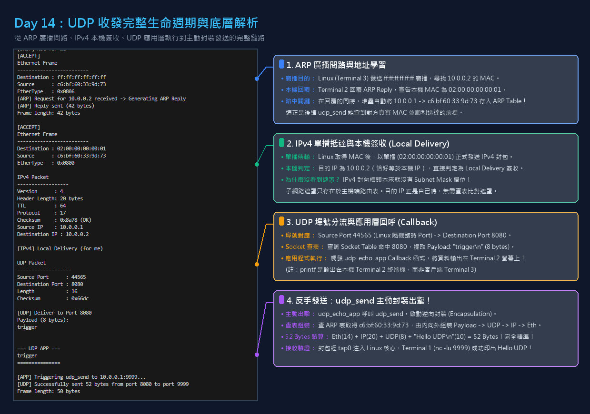

# Day 14：封包組裝與主動發送 — UDP Sender

昨天（Day 13）我們完成了**接收路徑（Receive Path）**，成功將外部客戶端傳來的資料一路從 L2 拆解到應用層：
```text
TAP (L2) ──► Ethernet (L2) ──► IPv4 (L3) ──► UDP (L4) ──► Application (L7)
```

然而，一個完整的網路協定堆疊絕不能「只進不出」。
今天（Day 14），我們正式打造逆向的**傳送路徑（Transmit Path）**，實作了從應用層由上至下親手「包禮物」的完整封裝流程（Encapsulation）：
```text
Application (L7) ──► UDP (L4) ──► IPv4 (L3) ──► ARP Lookup ──► Ethernet (L2) ──► TAP (L2)
```

透過本次實作，我們的自製 Network Stack 成功主動將 UDP 封包射出虛擬網卡，在 Linux 主機端的 `nc -lu 9999` 成功接收到來自我們的問候：
```text
Hello UDP
```

---

# 今日學習目標與成果

- [x] **掌握由上至下的封包封裝（Encapsulation）**：依序組裝應用層資料、UDP Header、IPv4 Header、計算 IP Checksum、查詢 ARP 並封裝 Ethernet Header。
- [x] **可指定來源埠號（Configurable Source Port）設計**：`udp_send()` 不在函式內部寫死來源 Port，而是由呼叫端傳入 `src_port`；本日範例使用 8080 作為伺服器回覆來源埠，未來也可傳入臨時埠號（Ephemeral Port）實作客戶端主動通訊。
- [x] **跨層協同運作（Cross-layer Coordination）**：在 L2 透過 `arp_table_lookup` 取得目標主機的實體 MAC 位址，體會「沒有 MAC 封包就出不去」的網路鐵律。
- [x] **釐清關鍵盲點（Subnet Mask 的本質）**：深刻理解 IPv4 標頭中本來就沒有子網路遮罩欄位，本機接收與路由轉發的判定機制。
- [x] **三終端機聯動實測與位元組級驗算（52 Bytes Exact Match）**：
  - 發送 `"Hello UDP\n"`（10 Bytes）。
  - 精確驗證總訊框長度 52 Bytes = Ethernet (14) + IPv4 (20) + UDP Header (8) + Payload (10)。

---

# 核心概念深入剖析

### 1. 封包封裝（Encapsulation）：由內向外的千層派

如果說 Day 13 的解封裝是「一層層拆禮物」，那麼 Day 14 的發送就是「一層層包裝禮物」：

```text
[ 應用層資料 Payload: "Hello UDP\n" (10 bytes) ]
       │
       ▼ 包上 UDP Header (8 bytes)
[ UDP Header (8) | Payload (10) ]
       │
       ▼ 包上 IPv4 Header (20 bytes，並計算校驗和)
[ IPv4 Header (20) | UDP Header (8) | Payload (10) ]
       │
       ▼ 查 ARP 表取得真實 MAC，包上 Ethernet Header (14 bytes)
[ Ethernet Header (14) | IPv4 Header (20) | UDP Header (8) | Payload (10) ]
       │
       ▼
write(tap_fd, buffer, 52) ──► 送入 TAP 虛擬網卡！
```

---

### 2. ARP Table 的關鍵角色：為什麼不能隨意偽造假 MAC？

在實作發送時，最常讓人疑惑的是：**「既然都在虛擬網卡裡，我們不能隨便給一個假 MAC 發送嗎？」**

答案是：**不行！因為接收端的作業系統（Linux 核心）跟我們一樣嚴格！**
1. 就像我們的程式有 `ethernet_accept_frame()` 會丟棄不是給自己的 MAC 封包一樣，Linux 的網卡驅動程式收到訊框時，也會檢查 `Destination MAC` 是否等於 `tap0` 網卡的真實 MAC 或廣播位址。
2. 若填入假 MAC，Linux 核心在 L2 就會直接無情**丟棄（DROP）**，封包根本連看都不看，上層的 `nc -lu 9999` 永遠收不到任何資料。
3. 因此，發送前必須透過 `arp_table_lookup((const uint8_t *)&dst_ip)` 查出對方的真實 MAC 位址，填入 `eth->dst`，封包才能被合法簽收。

---

### 3. 破除迷思：為什麼 IPv4 封包標頭裡沒有子網路遮罩？

在封包解析過程中，我們看到了來源 IP（`10.0.0.1`）與目的 IP（`10.0.0.2`），但卻完全沒看到子網路遮罩（Subnet Mask）的蹤影。

這是因為：
* **子網路遮罩只存在於主機本地的「設定與路由表」中**，用來在傳送或轉發時進行邏輯運算 `(IP & Mask) == Network Address`。
* **在網路上飛行的 IPv4 封包（RFC 791）本來就沒有子網路遮罩欄位**。
* 當封包到達本機時，核心只做一件事：比對 `ip->dst_ip == LOCAL_IP`。
  * 若相等 ➔ **Local Delivery（本機簽收）**，直接送往傳輸層，完全不需要查遮罩！
  * 若不相等 ➔ 才會進入路由表，利用遮罩計算該往哪張網卡或 Gateway 轉發。

---

# 實戰全流程圖解與註記

下圖為本次實測中，Terminal 2（Network Stack）從接收廣播、學習 MAC、本機交付，到反手呼叫 `udp_send` 發送的完整日誌與逐層解析：



> 實作前提：`udp_send()` 依賴 ARP Table 查詢目的 MAC，因此本日三終端機實測會先由 Linux 主機送一個 UDP 封包進來，讓我們的 Network Stack 透過先前的 ARP Request / Reply 流程學到 `10.0.0.1` 的 MAC。若 ARP Table 裡尚未有目的 IP 對應的 MAC，`udp_send()` 會印出 `Destination MAC not in ARP table` 並放棄送出。

---

# 關鍵程式碼實作

### 1. `include/udp.h`：宣告發送介面

```c
/* 支援由呼叫端指定來源 Port 的發送介面 */
int udp_send(int fd, uint16_t src_port, uint32_t dst_ip, uint16_t dst_port, const uint8_t *data, size_t len);
```

---

### 2. `src/udp.c`：`udp_send` 完整封裝實作

```c
#include <stdio.h>
#include <string.h>
#include <arpa/inet.h>
#include <unistd.h>     // 提供 write()

#include "ethernet.h"
#include "ipv4.h"
#include "udp.h"
#include "checksum.h"   // 提供 ipv4_checksum()
#include "arp_table.h"  // 提供 arp_table_lookup()
#include "config.h"     // 提供 LOCAL_MAC 與 LOCAL_IP

int udp_send(int fd, uint16_t src_port, uint32_t dst_ip, uint16_t dst_port, const uint8_t *data, size_t len)
{
    // 1. 查詢 ARP 表：要送到目標 IP，必須先知道對方的 MAC 位址
    struct arp_entry *entry = arp_table_lookup((const uint8_t *)&dst_ip);
    if (!entry || !entry->valid) {
        printf("[UDP] Send failed: Destination MAC not in ARP table\n");
        return -1;
    }

    // 2. 準備緩衝區，並切分各層標頭的指標位置
    uint8_t buffer[1514];
    memset(buffer, 0, sizeof(buffer));

    struct ethernet_hdr *eth = (struct ethernet_hdr *)buffer;
    struct ipv4_hdr *ip = (struct ipv4_hdr *)(buffer + ETH_HEADER_LEN);
    struct udp_hdr *udp = (struct udp_hdr *)(buffer + ETH_HEADER_LEN + sizeof(struct ipv4_hdr));
    uint8_t *payload = buffer + ETH_HEADER_LEN + sizeof(struct ipv4_hdr) + sizeof(struct udp_hdr);

    // 3. 填充 Payload (應用層資料)
    memcpy(payload, data, len);

    // 4. 封裝 UDP Header (L4)
    udp->src_port = htons(src_port);                   // 由呼叫端指定來源 Port (可為 8080 或臨時 Port)
    udp->dst_port = htons(dst_port);                   // 目標 Port
    udp->length = htons(sizeof(struct udp_hdr) + len); // UDP 標頭長度(8) + 資料長度
    udp->checksum = 0;                                 // IPv4 下 UDP Checksum 設為 0 代表不校驗

    // 5. 封裝 IPv4 Header (L3)
    ip->version_ihl = 0x45;                            // IPv4, 標頭長度 20 bytes (IHL=5)
    ip->tos = 0;
    ip->total_length = htons(sizeof(struct ipv4_hdr) + sizeof(struct udp_hdr) + len);
    ip->identification = htons(1);
    ip->flags_fragment = 0;
    ip->ttl = 64;
    ip->protocol = 17;                                 // 17 代表 UDP
    ip->src_ip = *(uint32_t *)LOCAL_IP;                // 10.0.0.2
    ip->dst_ip = dst_ip;                               // 目標 IP
    ip->checksum = 0;
    ip->checksum = ipv4_checksum(ip, sizeof(struct ipv4_hdr)); // 計算 IP 標頭校驗和

    // 6. 封裝 Ethernet Header (L2)
    memcpy(eth->dst, entry->mac, ETH_ADDR_LEN);        // 從 ARP 快取取得目標 MAC
    memcpy(eth->src, LOCAL_MAC, ETH_ADDR_LEN);         // 本機 MAC
    eth->ethertype = htons(ETHERTYPE_IPV4);            // 0x0800 代表 IPv4

    // 7. 透過 TAP 虛擬網卡送出 Frame
    size_t total_len = ETH_HEADER_LEN + sizeof(struct ipv4_hdr) + sizeof(struct udp_hdr) + len;
    ssize_t sent = write(fd, buffer, total_len);
    if (sent < 0) {
        perror("[UDP] write failed");
        return -1;
    }

    printf("[UDP] Successfully sent %ld bytes from port %u to port %u\n", sent, src_port, dst_port);
    fflush(stdout);
    return 0;
}
```

---

### 3. `src/tap.c`：全域網卡綁定與應用程式觸發

```c
static int global_tap_fd = -1;

void udp_echo_app(const uint8_t *data, size_t len)
{
    printf("\n=== UDP APP ===\n");
    fwrite(data, 1, len, stdout);
    printf("===============\n\n");
    fflush(stdout);

    // 收到請求後，主動發送一包 "Hello UDP" 到 10.0.0.1 的 9999 Port！
    printf("[APP] Triggering udp_send to 10.0.0.1:9999...\n");
    udp_send(global_tap_fd, 8080, inet_addr("10.0.0.1"), 9999, (const uint8_t *)"Hello UDP\n", 10);
}

int main()
{
    ...
    int fd = tun_alloc(dev);
    global_tap_fd = fd; // 保存網卡描述符供應用程式使用
    ...
}
```

---

# 實戰驗收：三終端機聯動

### 步驟 1：Terminal 1（接收端 Server）
```bash
# 在 Linux 主機端監聽 9999 Port 等待收信
nc -lu 9999
```

### 步驟 2：Terminal 2（你的 Network Stack）
```bash
make network
sudo ./network
```

### 步驟 3：Terminal 3（觸發發送的客戶端）
```bash
# 確保 tap0 IP 設定完畢並啟用
sudo ip addr add 10.0.0.1/24 dev tap0 2>/dev/null || true
sudo ip link set tap0 up

# 送出觸發封包
echo "trigger" | nc -u -w 1 10.0.0.2 8080
```

---

### 驗收輸出結果

#### 💻 Terminal 1 輸出：
```text
Hello UDP
```
*(成功接收到我們主動發出的資料！)*

#### 🖥️ Terminal 2 輸出：
```text
[ACCEPT]
Ethernet Frame
-------------------------
Destination : ff:ff:ff:ff:ff:ff
Source      : c6:bf:60:33:9d:73
EtherType   : 0x0806
[ARP] Request for 10.0.0.2 received -> Generating ARP Reply
[ARP] Reply sent (42 bytes)
Frame length: 42 bytes

[ACCEPT]
Ethernet Frame
-------------------------
Destination : 02:00:00:00:00:01
Source      : c6:bf:60:33:9d:73
EtherType   : 0x0800

IPv4 Packet
------------------
Version      : 4
Header Length: 20 bytes
TTL          : 64
Protocol     : 17
Checksum     : 0x8a78 (OK)
Source IP    : 10.0.0.1
Destination IP : 10.0.0.2

[IPv4] Local Delivery (for me)

UDP Packet
-------------------
Source Port      : 44565
Destination Port : 8080
Length           : 16
Checksum         : 0x66dc

[UDP] Deliver to Port 8080
Payload (8 bytes):
trigger


=== UDP APP ===
trigger
===============

[APP] Triggering udp_send to 10.0.0.1:9999...
[UDP] Successfully sent 52 bytes from port 8080 to port 9999
Frame length: 50 bytes
```

> 注意：這裡有兩個不同封包。`Frame length: 50 bytes` 是剛剛收到的 trigger UDP 封包長度；`Successfully sent 52 bytes` 則是 `udp_echo_app()` callback 中另外主動送出的 `"Hello UDP\n"` 封包長度，因此兩個數字不同是正常的。

---

### 位元組級精準驗算（Byte-by-Byte Breakdown）

| 協定層級 | 欄位 / 內容 | 長度 | 累計長度 | 說明 |
| :--- | :--- | :--- | :--- | :--- |
| **L2 Ethernet** | MAC Header | 14 Bytes | 14 Bytes | 目的 MAC (Linux tap0) + 來源 MAC (02:00:00:00:00:01) + 0x0800 |
| **L3 IPv4** | IP Header | 20 Bytes | 34 Bytes | IHL=5, Protocol=17, 10.0.0.2 ➔ 10.0.0.1, Checksum 重新計算 |
| **L4 UDP** | UDP Header | 8 Bytes | 42 Bytes | Src=8080, Dst=9999, Length=18, Checksum=0 |
| **L7 Application** | Payload 資料 | 10 Bytes | **52 Bytes** | 字串 `"Hello UDP\n"`（9 個字元 + 1 個換行符號） |

* **UDP Length** = $8 \text{ (UDP Header)} + 10 \text{ (Payload)} = 18 \text{ Bytes}$
* **總 Frame Length** = $14 + 20 + 8 + 10 = 52 \text{ Bytes}$

發送的每一筆資料長度與內容均精確吻合！

---

# Day 15 預告：第一個真實網路應用 — Mini DNS Client

有了收（Day 13）與發（Day 14）的完整傳輸層基礎，明天我們將打造第一個真正的網際網路應用：**Mini DNS Client**！

你將親手實作：
* **DNS 封包格式組裝**（Header、Question Section、QNAME 編碼）
* **透過 `udp_send` 向 Google 公共 DNS（`8.8.8.8:53`）主動發送查詢**
* **解析 DNS 回應封包**，親手將 `google.com` 翻譯成真正的 IP 位址！
