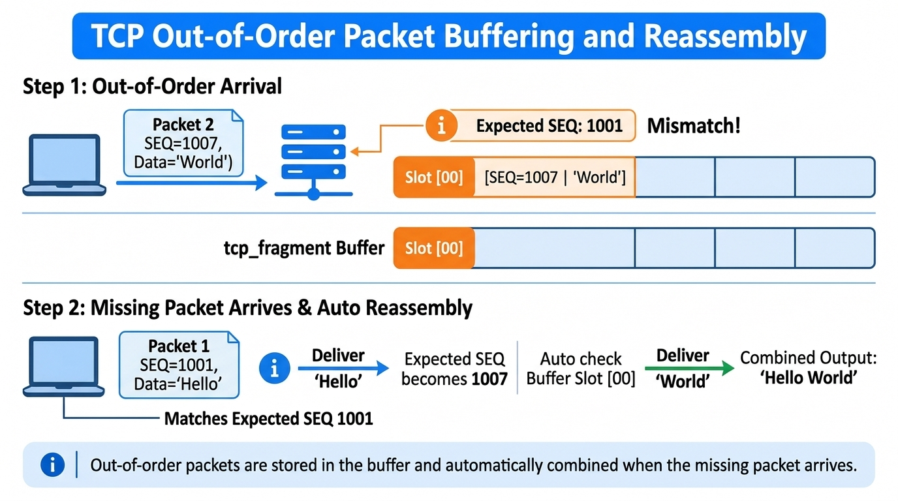
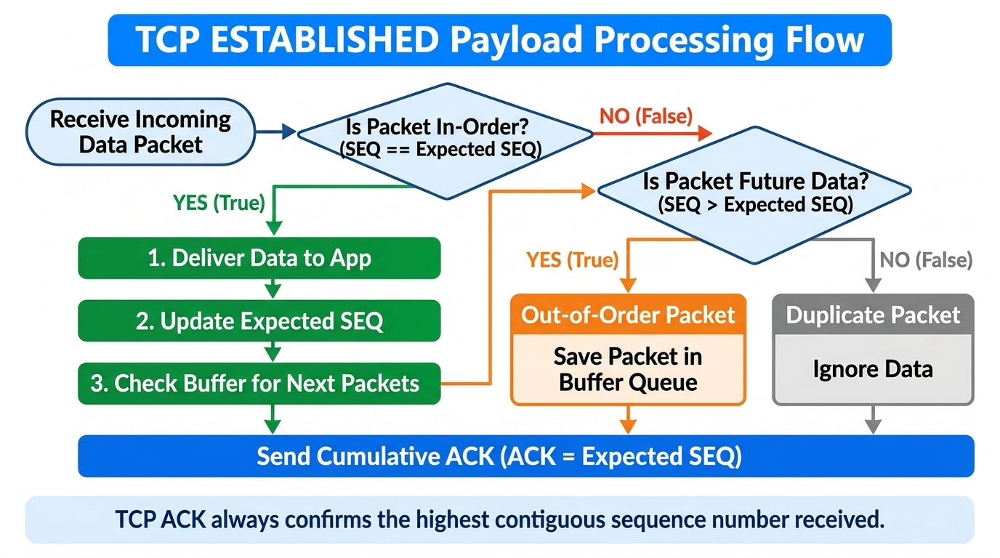

# Day 22：TCP Reassembly — 用 Sequence Number 重組資料流

在 TCP 通訊中，底層 IP 網路為不可靠的封包交換網路，不保證封包能依照發送順序抵達接收端。若直接將接收到的封包依序交給應用程式，將會導致資料交錯亂序（例如將 `"Hello World"` 錯印為 `"WorldHello"`）。

今天（Day 22），我們實作了 TCP 重組機制（Reassembly Buffer）與累積確認（Cumulative ACK）：當接收到未來的亂序封包時，將其暫存於結構體緩衝區中；待缺少的 Sequence Number 封包到達後，自動觸發連鎖效能釋放，還原出連續且正確的位元組流（Byte Stream）。



---

# 今日學習目標與成果

- [x] **擴充 `struct tcp_socket` 資料結構**：
  - 新增 `expected_seq` 追蹤期待接收的下一個 Sequence Number。
  - 建立 `struct tcp_fragment fragments[32]` 緩衝區與 `fragment_count` 數量紀錄。
- [x] **握手階段 Sequence Number 初始化**：
  - 在接收 SYN 封包時，精確計算 Client 的下一個期待序號：`conn->expected_seq = client_seq + 1`。
  - 防禦性清空重組緩衝區記憶體（`memset` 與 `fragment_count = 0`），避免舊連線雜訊污染新連線。
- [x] **實作亂序暫存輔助函式 `store_fragment()`**：
  - 檢查重複序號避免二次存入。
  - 自動尋找空 Slot (`used == 0`) 儲存 `seq`、`len` 與 Payload 內容。
- [x] **實作自動連鎖重組輔助函式 `process_buffered_fragments()`**：
  - 掃描置物櫃中匹配當前 `expected_seq` 的暫存封包。
  - 自動連鎖解鎖連續封包，依序交付應用程式並推進 `expected_seq`。
- [x] **重構 `tcp_receive()` 中的三大分流邏輯**：
  - **In-Order (`received_seq == expected_seq`)**：立即交付應用層、推進序號並觸發連鎖釋放。
  - **Out-of-Order (`received_seq > expected_seq`)**：辨識缺洞並呼叫 `store_fragment()` 暫存。
  - **Duplicate (`received_seq < expected_seq`)**：判斷為已接收的重複封包，安全忽略 Payload。
- [x] **實作 TCP 累積確認 (Cumulative ACK)**：
  - 無論接收情況為何，回傳的 ACK 號碼始終保持為 `conn->ack = conn->expected_seq`，精確回報已連續接收的最大序號。
- [x] **端對端亂序測試驗收**：
  - 撰寫 `test/send_tcp_reassembly.c` 刻意先發送 Packet 2 (`SEQ=1007`, `"World\n"`) 再發送 Packet 1 (`SEQ=1001`, `"Hello "`)。
  - 驗證 Server 成功連鎖重組拼出完整 `"Hello World\n"` 並將 Cumulative ACK 推進至 `1013`。

---

# 核心概念深入剖析

### 1. TCP Byte Stream 與 Sequence Number 的本質

UDP 屬於 Datagram（報文）導向的協定，每個封包彼此獨立；而 TCP 提供的是 **Byte Stream（位元組流）** 服務。應用程式關心的是完整的連續資料，而非單個網卡封包。

```text
發送端位元組流： [H][e][l][l][o][ ][W][o][r][l][d][\n]
                 ▲              ▲
                 SEQ=1001       SEQ=1007
```

TCP 透過 **Sequence Number** 為每一個傳輸的 Byte 編號。接收端透過 `expected_seq` 追蹤「目前已連續接收的邊界」，確保應用程式永遠看到正確排序的資料流。

---

### 2. TCP Payload 三大處理分流

下圖展示了在 `conn->state == TCP_ESTABLISHED` 收到 Payload 時，系統根據 `received_seq` 與 `conn->expected_seq` 比對後的處理流程：



| 分流情況 | 比對條件 | 系統處置動作 | Expected SEQ 推進 |
| :--- | :--- | :--- | :--- |
| **In-Order (按順序)** | `received_seq == expected_seq` | 1. 交付 Payload 給應用程式<br>2. 推進 `expected_seq += len`<br>3. 呼叫 `process_buffered_fragments()` | 推進 `+ len` (及暫存包長度) |
| **Out-of-Order (亂序)** | `received_seq > expected_seq` | 1. 偵測中間缺漏資料<br>2. 呼叫 `store_fragment()` 冰入置物櫃 | **不推進** |
| **Duplicate (重複)** | `received_seq < expected_seq` | 1. 辨識為過去已接收過的重複封包<br>2. 忽略 Payload | **不推進** |

---

### 3. Cumulative ACK（累積確認）的精髓

TCP 採用 **Cumulative ACK** 機制。接收端回覆的 `ACK` 號碼代表：
> **「我已經完整且連續收到了 Sequence Number 比 ACK 小的所有位元組，下一個請傳送序號等於 ACK 的位元組給我。」**

例如：
1. 先收到 `SEQ=1007` (Len=6) $\rightarrow$ 但缺了 `1001~1006` $\rightarrow$ Server 回覆 `ACK=1001`（告訴 Client: 我還在等 1001！）。
2. 後收到 `SEQ=1001` (Len=6) $\rightarrow$ 補齊 1001~1006 且連鎖取出 1007~1012 $\rightarrow$ Server 回覆 `ACK=1013`（告訴 Client: 我已經連續收到 1012 了，下一個請傳 1013！）。

---

# 程式碼實作細節

### 1. 資料結構擴充 (`include/tcp.h`)

```c
/* TCP 亂序封包暫存結構 */
struct tcp_fragment
{
    uint32_t seq;       // 亂序封包起點序號
    uint16_t len;       // Payload 長度
    uint8_t data[1500]; // 暫存資料內容
    int used;           // 0: 空位, 1: 已佔用
};

struct tcp_socket
{
    ...
    uint32_t expected_seq;     // 我下一個期待收到的 Client Sequence Number
    enum tcp_state state;

    /* 亂序重組 Buffer */
    struct tcp_fragment fragments[32];
    int fragment_count;
};
```

---

### 2. 核心重組與分流邏輯 (`src/tcp.c`)

```c
/* 儲存亂序 (未來) 封包至 Buffer */
static void store_fragment(struct tcp_socket *conn, uint32_t seq, const uint8_t *data, uint16_t len)
{
    for (int i = 0; i < 32; i++) {
        if (conn->fragments[i].used && conn->fragments[i].seq == seq) {
            return; // 避免重複暫存
        }
    }

    for (int i = 0; i < 32; i++) {
        if (!conn->fragments[i].used) {
            conn->fragments[i].seq = seq;
            conn->fragments[i].len = len;
            memcpy(conn->fragments[i].data, data, len);
            conn->fragments[i].used = 1;
            conn->fragment_count++;
            printf("[TCP Buffer] Stored Out-of-Order Fragment: SEQ=%u, Len=%u\n", seq, len);
            return;
        }
    }
}

/* 檢查並重組 Buffer 中的連續封包 */
static void process_buffered_fragments(struct tcp_socket *conn)
{
    int found = 1;
    while (found) {
        found = 0;
        for (int i = 0; i < 32; i++) {
            if (conn->fragments[i].used && conn->fragments[i].seq == conn->expected_seq) {
                printf("\n[TCP Reassembly] Found matching buffered fragment! SEQ=%u, Len=%u\n",
                       conn->fragments[i].seq, conn->fragments[i].len);
                
                tcp_dump_payload(conn->fragments[i].data, conn->fragments[i].len);
                conn->expected_seq += conn->fragments[i].len;
                conn->fragments[i].used = 0;
                conn->fragment_count--;

                found = 1; // 繼續檢查是否有連續的下一個封包
                break;
            }
        }
    }
}
```

---

# 實務驗證 log 紀錄

在測試程式 `send_tcp_reassembly` 刻意先送出 `SEQ=1007 ("World\n")` 後送出 `SEQ=1001 ("Hello ")` 時的完整執行日誌：

```text
[TCP] Received Payload: SEQ=1007, Len=6 (Expected SEQ=1001)
[TCP Reassembly] Out-of-Order Packet detected! (Missing bytes before SEQ 1007)
[TCP Buffer] Stored Out-of-Order Fragment: SEQ=1007, Len=6 (Total Buffered: 1)
[TCP] Sent ACK: SEQ=5001, ACK=1001

[TCP] Received Payload: SEQ=1001, Len=6 (Expected SEQ=1001)
[TCP Reassembly] Packet In-Order! Delivering to application...

[TCP DATA]
Hello 

[TCP Reassembly] Found matching buffered fragment! SEQ=1007, Len=6

[TCP DATA]
World

[TCP] Sent ACK: SEQ=5001, ACK=1013
```

---

# 總結與 Day 23 預告

今天我們成功解決了 TCP 中的 **亂序 (Out-of-Order)** 與 **重複 (Duplicate)** 兩大挑戰，使 TCP Stack 具備了強大的 Byte Stream 重組能力。

明天（Day 23），我們將挑戰 TCP 可靠傳輸（Reliable Transmission）的另一個核心痛點：**封包遺失 (Packet Loss) 與重傳機制 (Retransmission / Fast Retransmit)**！
