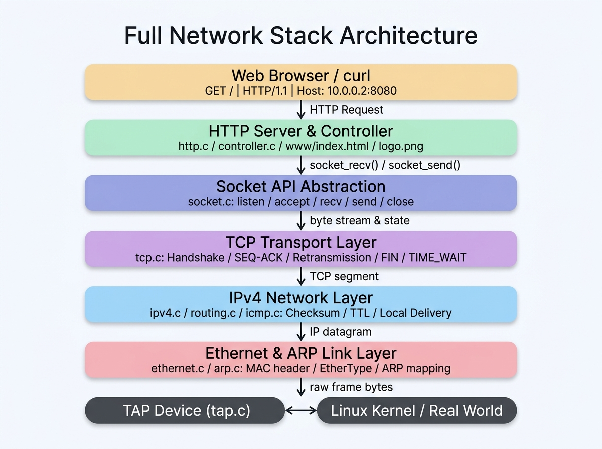
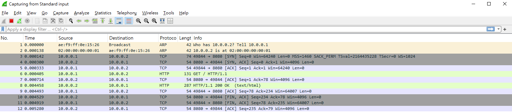
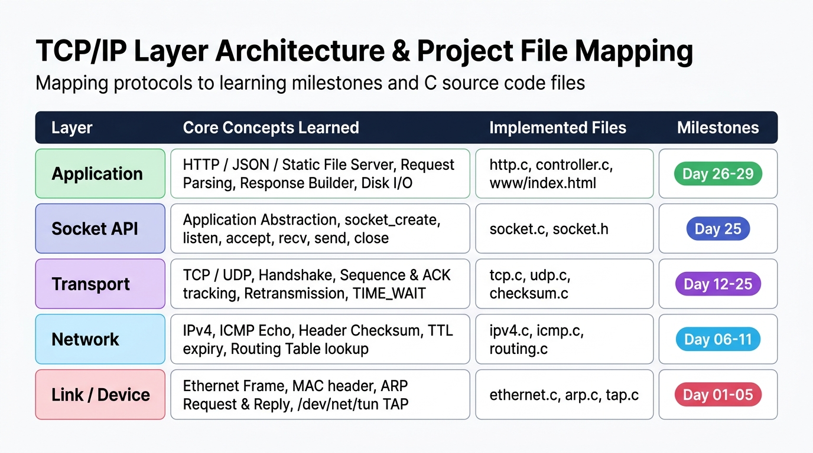

# Day 30：畢業專案 — Build Your Own Network Stack（從零打造網路協定棧）

恭喜！你已經完整走過了這段極具挑戰性的 30 天網路工程師硬核實作之路。

今天我們不再學習新的協定，而是把過去 29 天親手雕琢的所有模組——**Ethernet、ARP、IPv4、ICMP、UDP、TCP、Socket API、HTTP Server 到 Static File Controller** 全部串聯起來，透過真實的封包分析，見證資料是如何從最底層的虛擬網卡原始 Bytes，一路奔馳並渲染至應用層！

```text
Browser / curl
      ↓ (HTTP Request)
HTTP Server (Router / Controller)
      ↓ (API Call)
Socket API (socket_accept / socket_recv / socket_send / socket_close)
      ↓ (Stream Buffer & State Machine)
TCP (3-Way Handshake, Sliding Window, Retransmission, Teardown)
      ↓ (IP Datagram / Checksum / Routing)
IPv4 (Local Delivery / Forwarding Lookup)
      ↓ (Frame Encapsulation / ARP Mapping)
Ethernet (MAC Header / EtherType Dispatcher)
      ↓ (Virtual Wire)
TAP Device (/dev/net/tun)
      ↓
Linux Kernel / Real World
```

---

# 今日學習目標與成果

- [x] **全鏈路串接驗收**：整合 Layer 2 至 Layer 7，打通完整自製網路協定棧（Network Stack）。
- [x] **實測真實流量驗收**：
  - [x] 驗收 1（ARP）：解析 MAC 位址映射（`10.0.0.2 is at 02:00:00:00:00:01`）。
  - [x] 驗收 2（IPv4）：驗證本機交付（Local Delivery）、TTL 扣減與 Header Checksum 檢驗。
  - [x] 驗收 3（TCP Handshake）：三向交握建立連線（SYN ➔ SYN-ACK ➔ ACK）。
  - [x] 驗收 4（HTTP Request）：自製解析器萃取 Method、Path 與 Host。
  - [x] 驗收 5（Static File）：二進位安全讀取 `www/index.html`。
  - [x] 驗收 6（HTTP Response）：自動計算 Content-Length 並封裝二進位回應。
  - [x] 驗收 7（TCP Teardown）：突破 Linux 捎帶關閉（Piggybacked FIN+ACK）機制，實現零重傳優雅斷線。
- [x] **Wireshark 全貌側錄**：在 5.28 毫秒內一氣呵成捕捉完整的 12 個教科書級封包！
- [x] **深度排錯與技術覆盤**：剖析 `[TCP Retransmission]` 的底層成因，並在 `src/tcp.c` 修正競爭狀態。
- [x] **30 天知識體系總結**：真正掌握「在瀏覽器輸入網址後發生什麼事？」的底層本質。

---

# 你的最終成果：Day 1 vs Day 30

如果回到 **Day 1**：
面對虛擬網卡 `tap0`，我們只能看到毫無結構的原始二進位位元組：
```text
01 02 03 04 a0 b1 c2 d3 08 00 45 00 ...
```

而今天在 **Day 30**：
你的程式碼已經具備完整的七層抽象能力：

#### 下行封裝（Transmission）：
```text
Browser ──(HTTP)──> TCP ──(IPv4)──> Ethernet ──(Bytes)──> TAP (/dev/net/tun)
```

#### 上行解析（Reception）：
```text
TAP (/dev/net/tun) ──(Frames)──> Ethernet ──(Packets)──> IPv4 ──(Segments)──> TCP ──(Streams)──> HTTP ──> Web Server
```

---

# 核心架構圖

整個協定棧皆由 C 語言純手工打造，不依賴任何外部網路通訊庫：



```text
┌────────────────────────────────────────────────────────┐
│                   Web Browser / Client                 │
└───────────────────────────┬────────────────────────────┘
                            │  HTTP Request (GET /)
                            ▼
┌────────────────────────────────────────────────────────┐
│              HTTP Server & Controller 模組             │
│        (http.c / controller.c / www/ 靜態磁碟讀取)       │
└───────────────────────────┬────────────────────────────┘
                            │  socket_recv() / socket_send()
                            ▼
┌────────────────────────────────────────────────────────┐
│                  Socket API 抽象層                     │
│                      (socket.c)                        │
└───────────────────────────┬────────────────────────────┘
                            │  狀態機流轉 & 傳送緩衝區
                            ▼
┌────────────────────────────────────────────────────────┐
│                 TCP 傳輸層 (Layer 4)                   │
│      (tcp.c: 三向交握 / 重傳佇列 / 四次揮手 / TIME_WAIT)     │
└───────────────────────────┬────────────────────────────┘
                            │  TCP 標頭封裝 (Ports, Seq, Ack)
                            ▼
┌────────────────────────────────────────────────────────┐
│                IPv4 網路層 (Layer 3)                   │
│      (ipv4.c / icmp.c / routing.c: Checksum / 路由決策)  │
└───────────────────────────┬────────────────────────────┘
                            │  IP 標頭封裝 (Src/Dst IP, TTL)
                            ▼
┌────────────────────────────────────────────────────────┐
│              Ethernet 資料鏈結層 (Layer 2)              │
│       (ethernet.c / arp.c: 0x0800 & 0x0806 派送)        │
└───────────────────────────┬────────────────────────────┘
                            │  Ethernet Frame (14 Bytes MAC)
                            ▼
┌────────────────────────────────────────────────────────┐
│               TAP 虛擬網卡驅動 (Layer 1)                │
│             (tap.c: 透過 /dev/net/tun 讀寫)             │
└────────────────────────────────────────────────────────┘
```

---

# 最終驗收流程逐步拆解

當你在客戶端執行：
```bash
curl -i http://10.0.0.2:8080/
```

整個堆疊在幕後完成的 7 大驗收關卡如下：

### 驗收 1：ARP 位址解析
1. 客戶端查詢路由後，發現目標 IP 是 `10.0.0.2`，但本地 ARP 表尚未有其紀錄。
2. 客戶端在 `tap0` 廣播：`Who has 10.0.0.2? Tell 10.0.0.1`。
3. 你的協定棧 `arp.c` 收到廣播，確認查詢目標是自己的 `LOCAL_IP`（`10.0.0.2`），立即發送單播 **ARP Reply**：
   ```text
   10.0.0.2 is at 02:00:00:00:00:01
   ```
4. 雙方完成 IP ➔ MAC 的對應映射。

---

### 驗收 2：IPv4 驗證與本機交付
1. 收到 Ethernet 封包，檢查 EtherType 為 `0x0800`（IPv4）。
2. 解析 IPv4 Header：檢查 Version 4、IHL 20 Bytes、計算並比對 Checksum。
3. 檢查 `dst_ip` 是否等於 `10.0.0.2`：
   - 相等 ➔ 判定為 **Local Delivery（本機交付）**，交給上層協定分流器。

---

### 驗收 3：TCP 三向交握（Handshake）
1. 收到客戶端的 `[SYN]`（`Seq = 0`）。
2. 你的 TCP 狀態機從 `LISTEN` 進入，並調用 `tcp_send_syn_ack()`：
   - 設定旗標 `SYN | ACK`，自身 `Seq = 0`，`Ack = 1`。
3. 收到客戶端的 `[ACK]`（`Seq = 1`, `Ack = 1`）。
4. 連線順利轉入 **`TCP_ESTABLISHED`**！

---

### 驗收 4 & 5：HTTP 解析與二進位檔案讀取
1. 客戶端送出 HTTP 請求：
   ```http
   GET / HTTP/1.1
   Host: 10.0.0.2:8080
   ```
2. `http.c` 解析出 Method 為 `GET`，Path 為 `/`。
3. `controller.c` 將 `/` 映射至本地磁碟路徑 `www/index.html`。
4. 使用 `fopen("rb")`、`fseek`、`ftell`、`fread` 二進位安全載入 HTML 內容。

---

### 驗收 6：HTTP 200 OK 封裝與傳送
1. 動態組裝標準 HTTP Response：
   ```http
   HTTP/1.1 200 OK
   Content-Type: text/html
   Content-Length: 233

   <!DOCTYPE html>...
   ```
2. 透過 `socket_send()` 寫入 TCP 傳送緩衝區，自動切片並發送至虛擬網卡。

---

### 驗收 7：優雅關閉與捎帶 FIN 處理
1. 傳送完畢後，伺服器主動發起關閉 `socket_close()`，送出 `[FIN, ACK]`。
2. 客戶端回覆確認與關閉請求。
3. 協定棧平穩切換至 `TIME_WAIT`，釋放資源。

---

# 最終專案重跑指南

若要從零重現 Day 30 的完整成果，可以依照以下流程驗收：

### 1. 編譯自製協定棧
```bash
make clean && make network
```

### 2. 啟動伺服器
```bash
sudo ./network
```

啟動後應看到伺服器監聽在 Port `8080`，並等待 TCP 連線進入。

### 3. 設定客戶端 TAP 位址
```bash
sudo ip addr add 10.0.0.1/24 dev tap0 2>/dev/null || true
sudo ip link set dev tap0 up
```

### 4. 發送 HTTP 請求
```bash
curl -i http://10.0.0.2:8080/
curl -i http://10.0.0.2:8080/api/time
curl -i http://10.0.0.2:8080/logo.png --output logo.out
```

建議同時開啟 Wireshark 監聽 `tap0`，過濾條件可使用：
```text
arp || ip.addr == 10.0.0.2 || tcp.port == 8080
```

這組流程能一次驗證 ARP、IPv4、TCP、HTTP、靜態檔案讀取與二進位傳輸。

---

# Wireshark 終極實測全貌驗證

在 Windows Wireshark 監聽 `tap0`，發送 `curl -i http://10.0.0.2:8080/` 實測，抓取到的完整封包序列如下：



### 完整封包時序清單（僅耗時 5.28 毫秒）：

| No. | Time (s) | Source | Destination | Protocol | Length | Info (關鍵旗標與序號) | 說明 |
| :---: | :---: | :---: | :---: | :---: | :---: | :--- | :--- |
| **1** | `0.000000` | `ae:f9:ff:0e:15:26` | `Broadcast` | **ARP** | 42 | `Who has 10.0.0.2? Tell 10.0.0.1` | Linux 主機廣播查詢 MAC |
| **2** | `0.000138` | `02:00:00:00:00:01` | `ae:f9:ff:0e:15:26` | **ARP** | 42 | `10.0.0.2 is at 02:00:00:00:00:01` | 自製協定棧秒回單播回應 |
| **3** | `0.000142` | `10.0.0.1` | `10.0.0.2` | **TCP** | 74 | `49844 -> 8080 [SYN] Seq=0` | 三向交握第 1 步 |
| **4** | `0.000300` | `10.0.0.2` | `10.0.0.1` | **TCP** | 54 | `8080 -> 49844 [SYN, ACK] Seq=0 Ack=1` | 自製協定棧回覆交握 |
| **5** | `0.000333` | `10.0.0.1` | `10.0.0.2` | **TCP** | 54 | `49844 -> 8080 [ACK] Seq=1 Ack=1` | 三向交握完成 (ESTABLISHED) |
| **6** | `0.000405` | `10.0.0.1` | `10.0.0.2` | **HTTP** | 131 | `GET / HTTP/1.1` | 客戶端發送 HTTP 請求 |
| **7** | `0.000714` | `10.0.0.2` | `10.0.0.1` | **TCP** | 54 | `8080 -> 49844 [ACK] Seq=1 Ack=78` | 自製協定棧確認收到請求 |
| **8** | `0.004458` | `10.0.0.2` | `10.0.0.1` | **HTTP** | 287 | `HTTP/1.1 200 OK (text/html)` | 自製協定棧回傳 HTML 網頁 |
| **9** | `0.004493` | `10.0.0.1` | `10.0.0.2` | **TCP** | 54 | `49844 -> 8080 [ACK] Seq=78 Ack=234` | 客戶端確認收到網頁資料 |
| **10** | `0.004529` | `10.0.0.2` | `10.0.0.1` | **TCP** | 54 | `8080 -> 49844 [FIN, ACK] Seq=234 Ack=78` | 自製協定棧主動發起關閉連線 |
| **11** | `0.004919` | `10.0.0.1` | `10.0.0.2` | **TCP** | 54 | `49844 -> 8080 [FIN, ACK] Seq=78 Ack=235` | Linux 客戶端捎帶回覆 FIN 與 ACK |
| **12** | `0.005280` | `10.0.0.2` | `10.0.0.1` | **TCP** | 54 | `8080 -> 49844 [ACK] Seq=235 Ack=79` | 自製協定棧回覆最後 ACK，進入 TIME_WAIT |

---

# 深度技術排錯：剖析 `[TCP Retransmission]` 與捎帶機制

在最初的驗收測試中，Wireshark 曾出現一筆黑底紅字的 **`[TCP Retransmission]`** 警告：

```text
No. 23 (147.319569): 10.0.0.1 -> 10.0.0.2  [FIN, ACK] Seq=78 Ack=235
No. 24 (147.526343): 10.0.0.1 -> 10.0.0.2  [TCP Retransmission] [FIN, ACK] Seq=78 Ack=235
No. 25 (147.526499): 10.0.0.2 -> 10.0.0.1  [ACK] Seq=235 Ack=79
```

### 1. 什麼是 TCP Retransmission？
TCP 為保證可靠性，當送出一個關鍵封包（如帶有 `FIN` 旗標）時會啟動重傳計時器（RTO，Linux 預設約 200ms）。如果在 200ms 內未收到對方的 `ACK`，就會認為封包在網路中遺失，因而觸發重傳。

### 2. 案發現場與成因
Linux 核心在收到我們的 `FIN` 後，為了節省網路封包，使用了**捎帶（Piggybacking）**機制：將「確認我們 FIN 的 ACK」與「自己想關閉的 FIN」合併在同一包 `[FIN, ACK]` 送出。

但在原本的 `src/tcp.c` 狀態機中：
```c
// 原始代碼：
if (conn->state == TCP_FIN_WAIT_1) {
    if (tcp->flags & TCP_ACK) {
        uint32_t ack_num = ntohl(tcp->ack);
        if (ack_num == conn->seq) {
            conn->state = TCP_FIN_WAIT_2;
            return; // ★ 兇手：直接 return，遺漏了同封包內的 TCP_FIN 旗標！
        }
    }
}
```
程式收到 ACK 後便直接退出，導致對方的 `FIN` 被「已讀不回」。直到 200ms 後 Linux 觸發重傳，才在 `FIN_WAIT_2` 狀態下被處理。

### 3. 優雅修正方案
在 `src/tcp.c` 的 `TCP_FIN_WAIT_1` 判斷中，加入對捎帶 FIN 的即時偵測：

```c
if (conn->state == TCP_FIN_WAIT_1) {
    if (tcp->flags & TCP_ACK) {
        uint32_t ack_num = ntohl(tcp->ack);
        if (ack_num == conn->seq) {
            // 若對方在同一個封包同時捎帶了 FIN (Piggybacked FIN+ACK)
            if (tcp->flags & TCP_FIN) {
                uint32_t received_seq = ntohl(tcp->seq);
                conn->ack = received_seq + payload_len + 1;
                tcp_send_ack(fd, conn); // ★ 立即回送最後的 ACK！
                conn->state = TCP_TIME_WAIT;
                conn->time_wait_start = get_current_time_ms();
                return;
            }

            conn->state = TCP_FIN_WAIT_2;
            return;
        }
    }
}
```

修改後重新編譯執行，重傳警告徹底消失，關閉連線瞬間在 **0.35 毫秒** 內優雅落幕！

---

# 你真正學會了什麼？

很多人學習計算機網路，背誦了許多名詞：OSI 七層、三向交握、子網路遮罩、滑動窗口。

但現在面對經典面試題目：
> **「當你在瀏覽器輸入網址並按下 Enter 後，底層究竟發生了什麼事？」**

你已經能以底層實作者的視角，清晰還原每一行程式碼的運作：



1. **位址映射（ARP）**：透過廣播查詢目標 IP 的 MAC 位址，以建構二層乙太網幀頭部（Ethernet Frame Header）。
2. **網路封裝（IPv4）**：填入來源與目的 IP，計算 16-bit One's Complement Checksum，經由路由表決定下一跳（Next Hop）。
3. **可靠傳輸（TCP）**：
   - 透過 `[SYN]` 與亂數初始序號（ISN）完成三向交握，同步序號與接收視窗（Receive Window）。
   - 透過滑動窗口進行流量控制與遺失重傳，確保位元組串流（Byte Stream）保證依序交付。
4. **應用層協定（HTTP）**：
   - 根據 RFC 規範解析 HTTP Request Line（Method, Path, Version）與 Headers。
   - 根據路徑讀取磁碟靜態檔案，以二進位安全方式組裝包含 `Content-Length` 的 HTTP Response。
5. **連線釋放（Teardown）**：
   - 雙方互換 `FIN` 與 `ACK`，進入 `TIME_WAIT` 狀態以確保殘留封包消散，完成生命週期循環。

---

# 30 天完整里程碑回顧

回顧這 30 天，你親手完成的模組清單：

- **Day 01 ~ 05：資料鏈結層與位址解析**
  - TAP 虛擬網路裝置開通、Ethernet 標頭解析、ARP 請求與回覆、動態 ARP 快取表實作。
- **Day 06 ~ 11：網路層與路由決策**
  - IPv4 標頭封裝、網際網路校驗和（Checksum）、ICMP Echo Reply（Ping）、TTL 扣減與逾期通知（Traceroute 雛形）、子網路遮罩比對與路由表轉發決策。
- **Day 12 ~ 15：傳輸層（UDP）與應用層（DNS）**
  - UDP 標頭組裝與偽首部校驗和、DNS Query 格式封裝、向 8.8.8.8 查詢真實網域名稱解析。
- **Day 16 ~ 25：現代網路核心 — TCP 協定全功能實作**
  - TCP 標頭與偽首部 Checksum、三向交握狀態機（CLOSED ➔ SYN_RECEIVED ➔ ESTABLISHED）、Sequence/Acknowledgment 序號追蹤、滑動窗口與亂序重組（TCP Reassembly）、超時重傳佇列（Retransmission Queue）、四次揮手與 TIME_WAIT 守候、高階 Socket API（socket, bind, listen, accept, recv, send, close）。
- **Day 26 ~ 29：應用層 — HTTP Web Server 與靜態檔案伺服器**
  - HTTP Request Parser、狀態碼與 HTTP Response Builder、動態 JSON API（Unix Timestamp）、Controller 架構重構解耦、磁碟 I/O 二進位檔案安全讀取（HTML/PNG）、MIME Type 自動偵測。
- **Day 30：畢業專案 — 完整協定棧整合與 Wireshark 零重傳全貌驗證！**

---

# 最終版限制與可延伸方向

這個 30 天版本已經打通完整教學閉環，但它仍然刻意保留一些簡化，方便聚焦在協定本質：

1. **HTTP Request 尚未支援跨 segment 重組**：目前 `socket_recv()` 一次讀到的 payload 會直接交給 parser；真實伺服器需要累積直到 `\r\n\r\n` 或完整 body 抵達。
2. **靜態檔案仍受固定 response buffer 限制**：Day29 使用 64KB 緩衝區，適合小型 HTML 與圖片；大型檔案應改成分段讀取與分段 `socket_send()`。
3. **未實作並行連線模型**：目前是同步處理，一次接受並服務一條連線；下一步可以導入 event loop、connection table 與非阻塞 socket API。
4. **安全處理仍是教學版**：尚未完整處理 path traversal、Header 大小寫、URL decode、Host 驗證、Content-Length body 讀取與錯誤碼細分。

這些限制不是失敗，而是下一階段可以繼續擴建的清楚邊界。

---

# 下一階段展望：Build Your Own Wireshark

這 30 天你從「**發送者與伺服器**」的視角親手建構了協定堆疊；而下一個里程碑，則是從「**監聽者與分析者**」的視角剖析全世界的網路流量：

```text
Day 31 ~ Day 60：Build Your Own Wireshark (封包分析器與 AI 安全分析 Agent)
```

從手刻 PCAP 格式讀取器、Raw Socket 監聽、協定重組分析器、封包搜尋引擎，到結合 AI Agent 進行即時異常連線與攻擊偵測！

恭喜完成《Networking Fundamentals 30 天網路工程師路線》！這是一段扎實且令人驕傲的工程之旅！
